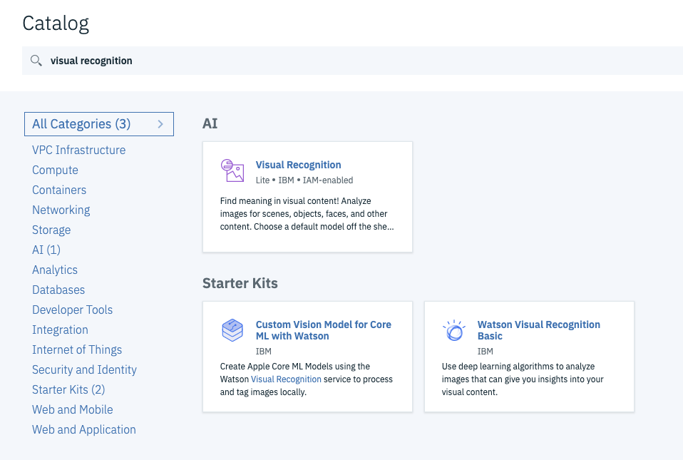

# Watson Studio Setup

#### Step 1:

In the Catalog search for `Watson Studio` . Click on `Watson Studio` 

#### **Step 2:**

Give the service a name. Select the lite plan and click create.

#### **Step 3:**

Click on `Get Started`

#### **Step 4:**

Click on `Create a project` 

#### Step 5: 

Select `Standard` . Give the project a name.. In the bottom at the Define Storage. Select the storage created in the previous step.

#### Step 6; 

From the Project window click to `Add to project` . 

#### Step 7: 

Select `Visual Recognition` 

#### Step 8: 

Click here on the prompt to select an existing service. Click on `Existing` on the top left and find the service created in the previous step.

#### Step 9: 

You should see a page like this.

At this step we are ready to train

