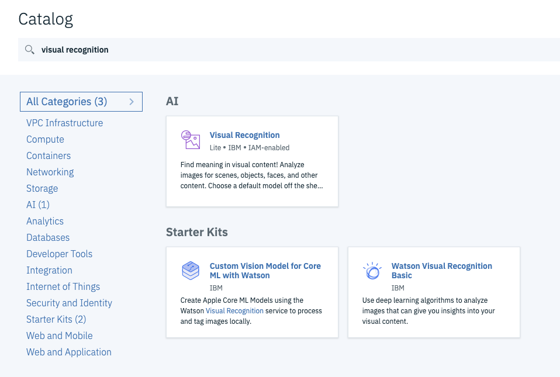

# Pre Setup

We would like to create a custom visual recognition model. 

We need a couple of things. 

1. Image Recognition
2. Somewhere to store the image and models.

Lets create those services.

Step 1:

Go to catalog on IBM Cloud.[https://cloud.ibm.com/catalog](https://cloud.ibm.com/catalog) 

Step 2: 

Search for `visual recogniton` 

Step 3:

Create a visual recognition service. Select `lite` for the plan.

Step 4:

Go back to the Catalog again. Search for `Object-Storage` create a object storage service.

We will use this 2 in the next step.

